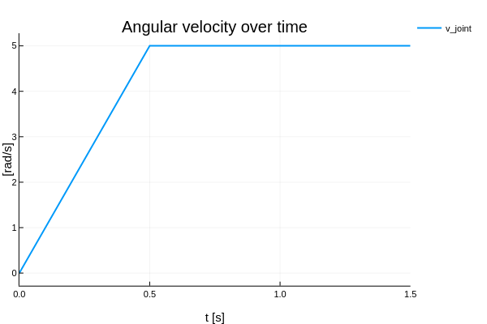
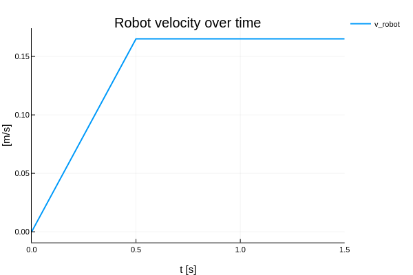
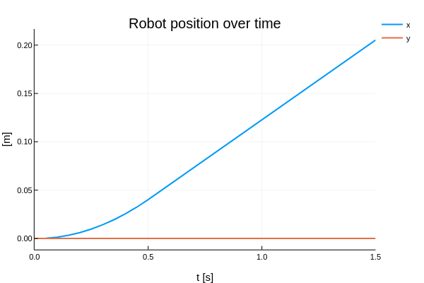
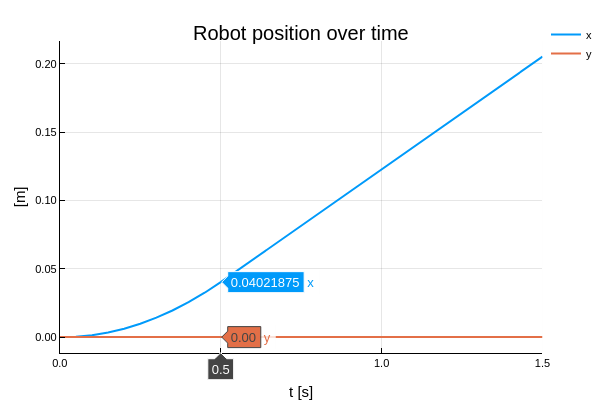
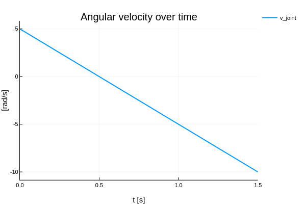
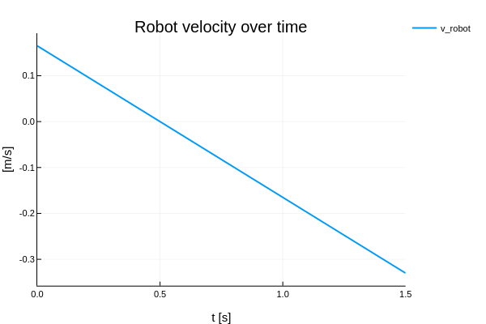
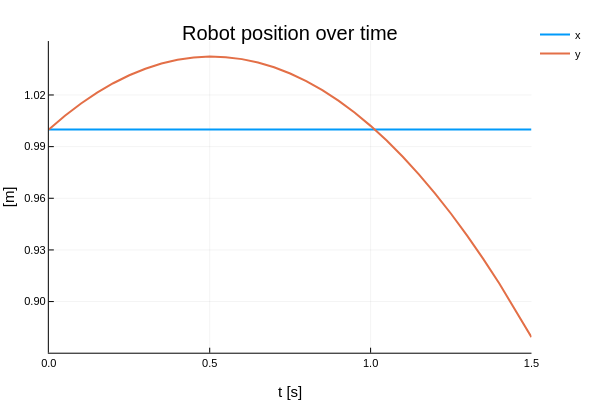
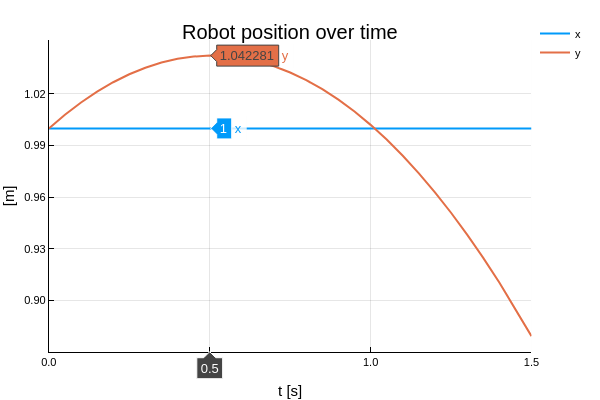

# Robot model

This project is for designing the control of a differential drive robot.

## Plots

### Constant acceleration followed by constant move

Assuming that the robot was controlled to accelerate for 0.5 sec and then to constant move for 1 sec:

  

#### Difference from ideal control



Assuming continuous control the highlighted value would have been `0.04125`.

### Constant deceleration from constant move

Assuming that the robot was controlled to decelerate for 1.5 sec from constant upward movement along the y axis:

  

The change in direction is smooth:



## Dependencies

You will need _Plots_ and _PlotlyJS_ to execute everything. Type in the _Julia console (REPL)_:

```julia
Pkg.add("Plots")
Pkg.add("PlotlyJS")
```
